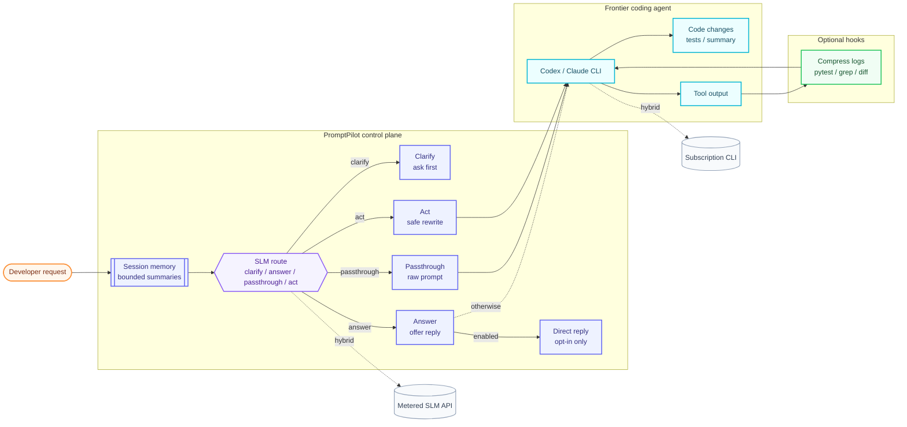

# PromptPilot

> Small-language-model control layer for AI coding agents.

PromptPilot helps Codex and Claude-style coding agents spend less context on avoidable work.

Long coding sessions often burn frontier-model tokens on ambiguous prompts, repeated session history, noisy tool output, and constraints that should have been made explicit before coding starts. PromptPilot adds a small language model (SLM) control layer in front of those agents to make that work clearer before the expensive model starts coding.

It clarifies unclear requests, rewrites prompts to preserve constraints, routes simple or risky requests appropriately, carries bounded session memory, and can compress noisy tool output through agent hooks.

The goal is not to replace the frontier model with a small language model. The SLM manages the workflow; the frontier model writes and debugs the code.

PromptPilot optimizes for **semantic-preserving context control**, not blind token reduction. A rewritten prompt may be longer than the original when that preserves constraints; the savings come from fewer ambiguous agent turns, bounded session replay, and compressed noisy context.

## How PromptPilot fits



For `answer`, PromptPilot skips the downstream coding agent only when direct SLM answering is enabled with `--let-slm-answer` or `PROMPTPILOT_LET_SLM_ANSWER`; otherwise the request continues to the agent. The diagram keeps node labels intentionally short so GitHub Mermaid previews do not clip long text.

**Measured example (hybrid mode):** in one 15-turn chain, ~24k input tokens of SLM work directed ~12.66M input tokens of agent work. The control layer was ~0.2% of the input-token footprint, and the bounded session ran the same multi-turn work on ~7.6x fewer input tokens than the tool's native `--resume` session. Hybrid mode can route the small control layer to metered API usage and the heavy coding-agent work to a subscription CLI. See [docs/HYBRID_MODE.md](docs/HYBRID_MODE.md) and [docs/BENCHMARKS.md](docs/BENCHMARKS.md). Single workload, not a guarantee.

> **First-time user?** Start with **[QUICKSTART.md](QUICKSTART.md)**.

> **Full documentation:** read the rendered **[PromptPilot GitHub Wiki](https://github.com/steyangdot/PromptPilot/wiki)**.

## Docs

Long-form documentation lives in [docs/](docs/) (source of truth) and is mirrored to the **[PromptPilot GitHub Wiki](https://github.com/steyangdot/PromptPilot/wiki)** by [scripts/publish_wiki.sh](scripts/publish_wiki.sh). The wiki is the easiest place to browse the project.

- Start at the **[GitHub Wiki home](https://github.com/steyangdot/PromptPilot/wiki)**, the [docs index](docs/README.md), or the [Project Overview](docs/PROJECT_OVERVIEW.md).
- Operational pages stay at the repo root: this README, [QUICKSTART.md](QUICKSTART.md), [SECURITY.md](SECURITY.md), [CONTRIBUTING.md](CONTRIBUTING.md).

## Install

PromptPilot wraps an existing coding agent CLI, so install and authenticate at least one agent first:

- **Claude Code:** `npm install -g @anthropic-ai/claude-code`, then `claude auth login --claudeai`
- **Codex:** `npm install -g @openai/codex`, then `codex login`

Then install PromptPilot. Use the extra that matches the small-model API path you want available:

```bash
pip install prpt[claude]      # Claude/Anthropic SLM path
pip install prpt[codex]       # Codex/OpenAI SLM path
pip install prpt[all]         # both
```

Subscription CLI auth and API keys both work; hybrid mode can use an API key for the small control layer and a subscription CLI for the coding agent. `[anthropic]` / `[openai]` are kept as aliases for backward compatibility.

## First run

```bash
cd /path/to/your/repo
prpt setup                                # one-time onboarding (checks + smoke test)
prpt "fix the flaky test in payments"     # auto-detects claude or codex from PATH
prpt --dry-run "refactor auth, no API changes"  # preview the optimized prompt
prpt --tool codex "add dark mode"         # force a specific agent
prpt doctor                               # re-run setup checks if something breaks
prpt install-hook                         # optional: wire prompt/tool hooks into Claude Code
```

After many turns the session grows heavy:

```bash
prpt restart                              # checkpoint -> handoff.md -> bootstrap fresh
```

## What a run looks like

```text
$ prpt "the test in tests/test_auth.py::test_token_refresh is flaky on CI
        but passes locally. keep the public API of TokenStore intact."
[promptpilot] session: carrying 0 prior turns
[promptpilot] route=act
[token stats] raw 248 → optimized 332 tokens (SLM call: $0.0021)
=== forwarding to claude-code ===
... agent works ...
✓ tests/test_auth.py::test_token_refresh now stable (3/3 CI retries)
```

The SLM expanded the raw 248-token prompt into a 332-token optimized version that pinned the failing test name and made the `TokenStore` API-stability constraint explicit before the coding agent saw it. Walkthrough in [docs/TELEMETRY_AND_REPLAY.md](docs/TELEMETRY_AND_REPLAY.md).

For the full guide see **[QUICKSTART.md](QUICKSTART.md)** and `prpt --help`
(or `prpt --advanced-help` for internal/researcher flags).
