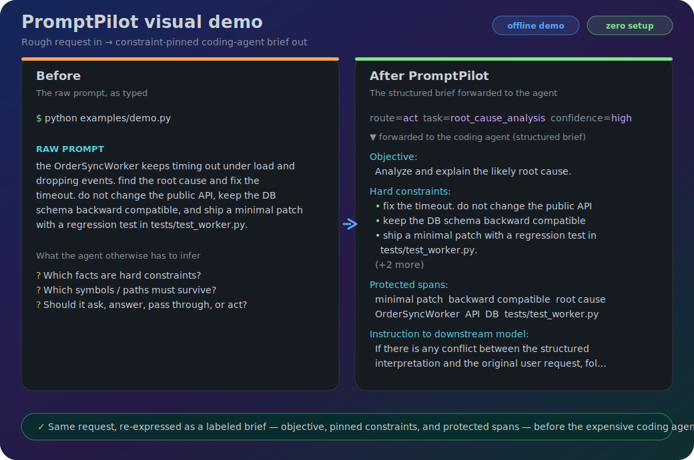

# PromptPilot

> Small-language-model control layer for AI coding agents.

**PromptPilot puts a cheap small model in front of Codex and Claude Code: it turns a rough prompt into a clear, constraint-pinned brief — so the frontier model stops burning tokens on ambiguity, repeated history, and noisy tool output.**

## What it does

- **Clarifies vague requests** — flags ambiguity and asks first instead of guessing.
- **Pins constraints & protected spans** — APIs, file paths, "don't touch X" go into the prompt explicitly.
- **Routes every request** — *clarify / answer / passthrough / act* — instead of blindly forwarding.
- **Bounds session memory** — long sessions don't re-feed the whole transcript every turn.
- **Compresses noisy tool output** — pytest / grep / diff, via agent hooks, before the expensive model reads it.

The SLM manages the workflow; the frontier model still writes and debugs the code. PromptPilot optimizes for **semantic-preserving context control**, not blind token reduction — a rewrite may be *longer* when that preserves a constraint. The savings come from fewer ambiguous turns, bounded replay, and compressed context.

> **Measured (hybrid mode, one 15-turn chain):** ~24k input tokens of SLM work directed ~12.66M input tokens of agent work — the control layer was **~0.2%** of the input footprint, and the bounded session ran the same work on **~7.6× fewer** input tokens than the tool's native `--resume`. Single workload, not a guarantee — see [Benchmarks](docs/BENCHMARKS.md) and [Hybrid Mode](docs/HYBRID_MODE.md).

## How it works


For `answer`, PromptPilot skips the downstream coding agent only when direct SLM answering is enabled (`--let-slm-answer` or `PROMPTPILOT_LET_SLM_ANSWER`); otherwise the request continues to the agent. The diagram keeps node labels short so GitHub Mermaid previews do not clip long text.

Dig deeper in [Architecture](docs/ARCHITECTURE.md), [Routes and Decisions](docs/ROUTES_AND_DECISIONS.md), and [Semantic Preservation](docs/SEMANTIC_PRESERVATION.md).

## Install

PromptPilot wraps an existing coding-agent CLI — install and authenticate at least one first:

- **Claude Code:** `npm install -g @anthropic-ai/claude-code` → `claude auth login --claudeai`
- **Codex:** `npm install -g @openai/codex` → `codex login`

```bash
pip install prpt[claude]      # Claude/Anthropic SLM path
pip install prpt[codex]       # Codex/OpenAI SLM path
pip install prpt[all]         # both
```

Subscription auth and API keys both work; **hybrid mode** can route the small control layer to a metered API key and the coding agent to a subscription CLI. (`[anthropic]` / `[openai]` remain as aliases.)

## First run

```bash
cd /path/to/your/repo
prpt setup                                # one-time onboarding (checks + smoke test)
prpt "fix the flaky test in payments"     # auto-detects claude or codex from PATH
prpt --dry-run "refactor auth, no API changes"  # preview the optimized prompt
prpt --tool codex "add dark mode"         # force a specific agent
prpt restart                              # collapse a heavy session -> handoff.md -> fresh
```

> **Applying edits:** `prpt "..."` forwards the brief to the agent in a single non-interactive pass, and in that mode **neither agent writes files by default** — **Claude Code** *proposes* edits (pending approval), **Codex** runs in a *read-only sandbox*. To let them apply changes, add the agent's auto-approve flag: Claude → `--tool-arg=--permission-mode --tool-arg=acceptEdits`; Codex → `--tool-arg=--full-auto`. Or use `prpt install-hook` (below) to run the optimization *inside* an interactive Claude Code / Codex session where you approve changes as usual. `--dry-run` only prints the brief.

`prpt doctor` re-runs setup checks; `prpt install-hook` wires prompt/tool hooks into Claude Code (or Codex via `prpt install-hook --tool codex`). Full flag set: `prpt --help` (or `prpt --advanced-help` for researcher/internal flags). New here? → **[QUICKSTART.md](QUICKSTART.md)**.

## Demo



See the SLM control layer reshape a rough prompt into a structured brief, with **zero setup** — no API key, no coding agent, no network:

```bash
python examples/demo.py
```

Sample output, the live-SLM run, and every flag are in the **[demo walkthrough → examples/README.md](examples/README.md)**.

## Docs

Long-form docs live in [docs/](docs/) (source of truth), mirrored to the **[PromptPilot GitHub Wiki](https://github.com/steyangdot/PromptPilot/wiki)** by [scripts/publish_wiki.sh](scripts/publish_wiki.sh). Start at the [Project Overview](docs/PROJECT_OVERVIEW.md) or the [docs index](docs/README.md). Operational pages stay at the repo root: [QUICKSTART.md](QUICKSTART.md), [SECURITY.md](SECURITY.md), [CONTRIBUTING.md](CONTRIBUTING.md).
