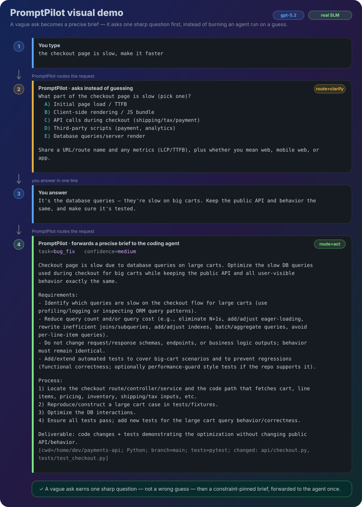

# PromptPilot

> Small-language-model control layer for AI coding agents.

**PromptPilot puts a cheap small model in front of Codex and Claude Code: it turns a rough prompt into a clear, constraint-pinned brief — so the frontier model stops burning tokens on ambiguity, repeated history, and noisy tool output.**

## What it does

- **Clarifies vague requests** — flags ambiguity and asks first instead of guessing.
- **Pins constraints & protected spans** — APIs, file paths, "don't touch X" go into the prompt explicitly.
- **Routes every request** — *clarify / answer / passthrough / act* — instead of blindly forwarding.
- **Bounds session memory** — long sessions don't re-feed the whole transcript every turn.
- **Compresses noisy tool output** — pytest / grep / diff, via agent hooks, before the expensive model reads it.

The SLM manages the workflow; the frontier model still writes and debugs the code. PromptPilot optimizes for **semantic-preserving context control**, not blind token reduction — a rewrite may be *longer* when that preserves a constraint. The savings come from fewer ambiguous turns, bounded replay, and compressed context.

> **Measured (chain_auth, N=5, end-state parity):** on **Codex**, bounding the ever-growing native transcript feeds the model **~4.2× fewer total tokens** (4.47M → 1.07M/run) — and **~2× fewer full-price (uncached) tokens**, the cache-sensitive metric — at the same task quality. On **Claude Code**, native `--resume` already caches history cheaply, so PromptPilot keeps it and wins on the **rewrite** instead — **~1.25× fewer full-price tokens** than the raw prompt + native resume, at parity. The SLM control layer itself is **~0.2%** of the input footprint. These are a **CLI / automation** story — the win compounds across multi-turn *programmatic* runs (agent chains, headless `exec` / `--resume` loops, CI/batch) where the native transcript grows every turn, so it's far smaller on a one-off interactive prompt. See [Benchmarks](docs/BENCHMARKS.md) and [Hybrid Mode](docs/HYBRID_MODE.md).

## Demo



*Above: a real `gpt-5.2` run (`slm-openai-v2`). A vague one-liner routes to **`clarify`** — PromptPilot asks one sharp question instead of guessing — and after a short, informal answer it routes **`act`** and expands it into a precise, constraint-pinned brief (the developer names the bottleneck; PromptPilot does the scoping and the agent does the diagnosis). Steps 2 and 4 are genuine small-model output; refresh with `python scripts/make_demo_svg.py --live`.*

Run the same control layer yourself with **zero setup** — `python examples/demo.py` defaults to the **offline** heuristic normalizer (no API key, no coding agent, no network); add `--slm` for the live routing + rewrite pictured above. The `clarify` route needs a v2 SLM backend, which the default `slm` now auto-selects for whichever auth you have — `slm-anthropic-v2` / `slm-openai-v2` (API key) or `slm-subscription-v2` (Max OAuth / ChatGPT):

```bash
python examples/demo.py          # offline heuristic — zero setup
python examples/demo.py --slm    # live routing + rewrite (needs an API key)
```

Sample output, the live-SLM run, and every flag are in the **[demo walkthrough → examples/README.md](examples/README.md)**.

## How it works


```mermaid
%%{init: {"flowchart": {"curve": "basis", "nodeSpacing": 50, "rankSpacing": 64}}}%%
flowchart LR
  U([Developer request])

  subgraph PP["PromptPilot SLM control plane (~0.2% of tokens)"]
    direction TB
    C{{"Route + classify<br/>act / clarify / answer / passthrough"}}
    R["Rewrite<br/>precise, self-sufficient<br/>+ target files, scope, constraints"]
    M[["Bounded session memory<br/>one-line intent + constraints per turn"]]
  end

  subgraph SS["Session strategy (tool-aware)"]
    direction TB
    K["Codex<br/>inject bounded record<br/>native transcript grows, so bound it"]
    L["Claude Code<br/>lean on native resume<br/>cache is cheap, so do not bound"]
  end

  subgraph AG["Frontier coding agent"]
    direction TB
    F["Codex / Claude CLI<br/>writes and debugs the code"]
    O["Edits, tests, summary"]
    T["Tool output"]
    H["Compress logs<br/>pytest / grep / diff"]
  end

  U --> C
  C -->|act| R
  C -. "clarify becomes act when autonomous" .-> R
  R --> M
  M --> K --> F
  M --> L --> F
  F --> O
  F --> T --> H --> F
  O -. "SLM distills each turn" .-> M

  classDef entry fill:#fff7ed,stroke:#fb923c,stroke-width:2px,color:#7c2d12;
  classDef control fill:#eef2ff,stroke:#6366f1,stroke-width:2px,color:#312e81;
  classDef route fill:#f5f3ff,stroke:#8b5cf6,stroke-width:2px,color:#4c1d95;
  classDef sess fill:#fffbeb,stroke:#f59e0b,stroke-width:2px,color:#78350f;
  classDef agent fill:#ecfeff,stroke:#06b6d4,stroke-width:2px,color:#164e63;
  classDef hook fill:#f0fdf4,stroke:#22c55e,stroke-width:2px,color:#14532d;

  class U entry;
  class R,M control;
  class C route;
  class K,L sess;
  class F,O,T agent;
  class H hook;
```

The SLM control plane is a tiny layer (~0.2% of the run's tokens) that *shapes* the agent's work without doing it. Routing: **act** rewrites the prompt; **passthrough** sends the raw prompt straight to the agent; **answer** lets the SLM reply directly and skip the agent *only* when enabled (`--let-slm-answer` / `PROMPTPILOT_LET_SLM_ANSWER`); and in autonomous mode (`PROMPTPILOT_AUTONOMOUS=1`) a **clarify** degrades to **act** (there is no human to answer). Bounding the session is **itself SLM work**: each turn the small model distills the request into the one-line intent + constraints record that seeds the next turn (only the list of files the agent changed is appended mechanically) — the frontier model never summarizes itself. The session strategy is **tool-aware** — PromptPilot bounds the session on Codex (whose native transcript grows uncached) and defers to native `--resume` on Claude Code (whose cache makes history nearly free). Labels are kept short so GitHub's Mermaid preview does not clip them.

Dig deeper in [Architecture](docs/ARCHITECTURE.md), [Routes and Decisions](docs/ROUTES_AND_DECISIONS.md), and [Semantic Preservation](docs/SEMANTIC_PRESERVATION.md).

## Install

PromptPilot wraps an existing coding-agent CLI — install and authenticate at least one first:

- **Claude Code:** `npm install -g @anthropic-ai/claude-code` → `claude auth login --claudeai`
- **Codex:** `npm install -g @openai/codex` → `codex login`

```bash
pip install prpt[claude]      # Claude/Anthropic SLM path
pip install prpt[codex]       # Codex/OpenAI SLM path
pip install prpt[all]         # both
```

Subscription auth and API keys both work; **hybrid mode** can route the small control layer to a metered API key and the coding agent to a subscription CLI. (`[anthropic]` / `[openai]` remain as aliases.)

## First run

```bash
cd /path/to/your/repo
prpt setup                                # one-time onboarding (checks + smoke test)
prpt "fix the flaky test in payments"     # auto-detects claude or codex from PATH
prpt --dry-run "refactor auth, no API changes"  # preview the optimized prompt
prpt --tool codex "add dark mode"         # force a specific agent
prpt restart                              # collapse a heavy session -> handoff.md -> fresh
```

> **Applying edits:** `prpt "..."` forwards the brief to the agent in a single non-interactive pass, and in that mode **neither agent writes files by default** — **Claude Code** *proposes* edits (pending approval), **Codex** runs in a *read-only sandbox*. To let them apply changes, add the agent's auto-approve flag: Claude → `--tool-arg=--permission-mode --tool-arg=acceptEdits`; Codex → `--tool-arg=--full-auto`. Or use `prpt install-hook` (below) to run the optimization *inside* an interactive Claude Code / Codex session where you approve changes as usual. `--dry-run` only prints the brief.

`prpt doctor` re-runs setup checks; `prpt install-hook` wires prompt/tool hooks into Claude Code (or Codex via `prpt install-hook --tool codex`). Full flag set: `prpt --help` (or `prpt --advanced-help` for researcher/internal flags). New here? → **[QUICKSTART.md](QUICKSTART.md)**.

## Docs

Long-form docs live in [docs/](docs/) (source of truth), mirrored to the **[PromptPilot GitHub Wiki](https://github.com/steyangdot/PromptPilot/wiki)** by [scripts/publish_wiki.sh](scripts/publish_wiki.sh). Start at the [Project Overview](docs/PROJECT_OVERVIEW.md) or the [docs index](docs/README.md). Operational pages stay at the repo root: [QUICKSTART.md](QUICKSTART.md), [SECURITY.md](SECURITY.md), [CONTRIBUTING.md](CONTRIBUTING.md).
